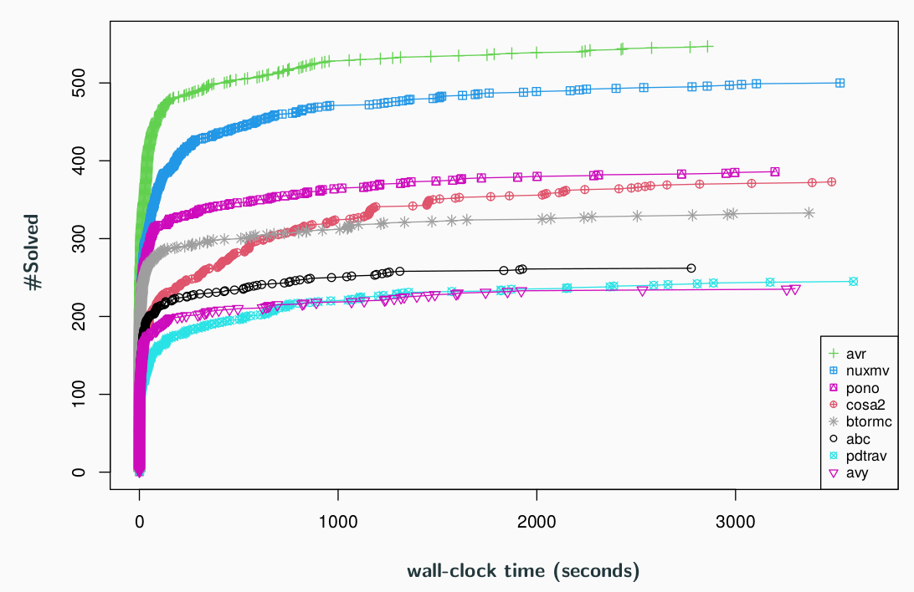
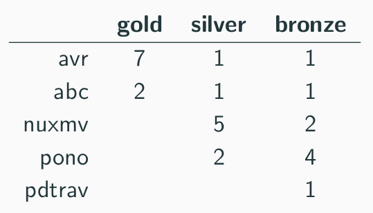
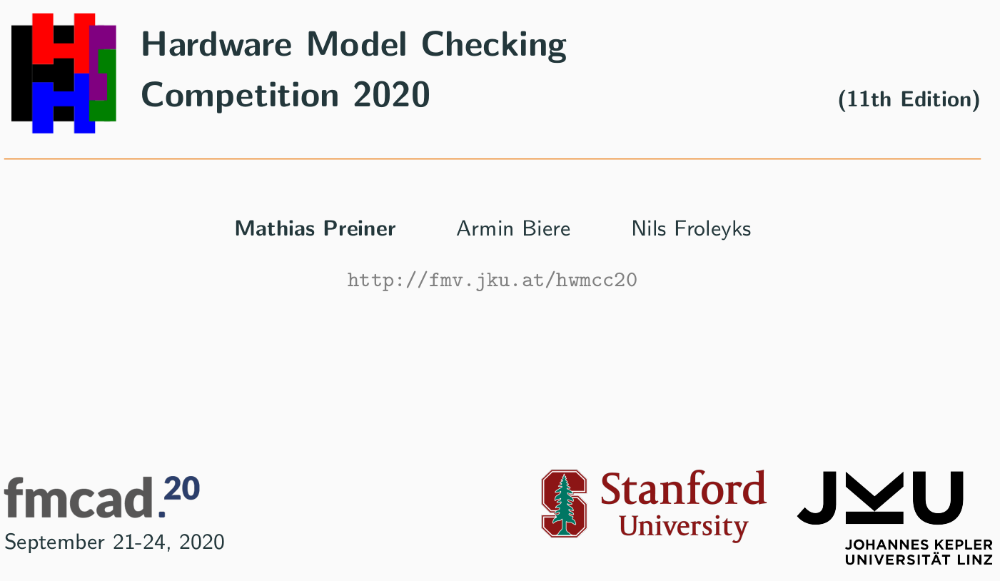

# HWMCC'20

This was the 11th competitive event for hardware model checkers.

## Affiliated to [FMCAD'20](https://fmcad.forsyte.at/FMCAD20/)
### September 21 - 24, 2020

## Results

Congratulations go to the overall winner:  

**AVR: Abstractly Verifying Reachability** by  
[Aman Goel](https://aman-goel.github.io/)
and [Karem Sakallah](http://web.eecs.umich.edu/~karem/) (Univ. of Michigan).

In total we awarded **27 "medals"**, with 3 medals in each of the BV, BV+Arrays and
the combined category, with SAT, UNSAT, and SAT+UNSAT (all) sub-tracks.

## Slides

The slides summarizing the results and presented in the
[HWMCC session](https://easychair.org/smart-program/FMCAD2020) at
[FMCAD](https://fmcad.forsyte.at/FMCAD20)
are available as [hwmcc20slides.pdf](hwmcc20slides.pdf).

## Benchmarks

The selected (single property) benchmarks are available as
[hwmcc20benchmarks.tar.xz](hwmcc20benchmarks.tar.xz) both in BTOR as well as
bit-blasted in AIGER format.

## Logfiles

The log files of the runs are available as
[hwmcc20runs.tar.xz](hwmcc20runs.tar.xz).

We also provide supplementary tables with additional model checkers:

- [BV (sat)](hwmcc20-bv-sat.txt)
- [Array (sat)](hwmcc20-array-sat.txt)
- [Comined (sat)](hwmcc20-combined-sat.txt)
- [BV (unsat)](hwmcc20-bv-uns.txt)
- [Array (unsat)](hwmcc20-array-uns.txt)
- [Combined (unsat)](hwmcc20-combined-uns.txt)
- [BV (all)](hwmcc20-bv-all.txt)
- [Array (all)](hwmcc20-array-all.txt)
- [Combined (all)](hwmcc20-combined-all.txt)

>

Finally, here are CSV files with one row per benchmark and one column per model
checker:

- [BV (sat)](hwmcc20-bv-sat.csv)
- [Array (sat)](hwmcc20-array-sat.csv)
- [Combined (sat)](hwmcc20-combined-sat.csv)
- [BV (unsat)](hwmcc20-bv-uns.csv)
- [Array (unsat)](hwmcc20-array-uns.csv)
- [Combined (unsat)](hwmcc20-combined-uns.csv)
- [BV (all)](hwmcc20-bv-all.csv)
- [Array (all)](hwmcc20-array-all.csv)
- [Combined (all)](hwmcc20-combined-all.csv)

Note that the bounds columns are only computed for AIGER model checkers and
actually off by one in many cases (220 out of 324 BV benchmarks).
We had to remove constraints with the tool `aigunconstraint` due to
discrepancies showing up with constraints.
However, not all bit-blasted AIGER models had constraints (actually 104 did
not).
You find those by grepping for `aigunconstraint` in the provided error files
`.err` files.

The plots and tables and are generated by the HWMCC'20 version of `zummarize`
available as [hwmcc20zummarize.tar.xz](hwmcc20zummarize.tar.xz).

## Format

In 2020 we only had a word-level track based on the
BTOR2 format, which is described in our
[CAV'18 paper](https://link.springer.com/content/pdf/10.1007%2F978-3-319-96145-3_32.pdf).
The [Btor2Tools](https://github.com/Boolector/btor2tools/)
tool suite provides a generic parser
[Btor2Parser](https://github.com/Boolector/btor2tools/tree/master/src/btor2parser)
and a simulator
[BtorSim](https://github.com/Boolector/btor2tools/tree/master/src/btorsim),
which are useful for parsing and random simulation of BTOR2 models, as well as
for witness checking.
There is also a simple bounded model checker
[BtorMC](https://github.com/Boolector/boolector/blob/master/src/btormc.c),
distributed as part of
[Boolector](https://github.com/Boolector/boolector).

Due to the low number of submissions of AIGER model checkers we did not run a
single safety property track using the AIGER format as in earlier competitions
until 2017.
Instead we were running model checkers only supporting the AIGER format on
bit-blasted word-level models.
This allowed to compare AIGER model checker directly with word-level model
checkers, exept that we can not bit-blast arrays which puts AIGER model checker
at a big disadvantage in the overall ranking.

## Setup

The hardware setup was identical to the competition in 2019.
It was running on our
**Ubuntu 18.04.5 LTS 64 bit** cluster
with two
**Intel(R) Xeon(R) CPU E5-2620 v4 @ 2.10GHz** CPUs
and **128 GB of main memory** on each node.

Each solver had full access to both processors on one node, thus combined
**16 cores** (32 virtual cores) and **128 GB** of main memory.
Accordingly a **memory limit of 120GB** will be enforced.
As in the previous competitions we will further used a
**time limit of 1 hour** of wall clock-time.

## Submission

Email submissions to  
- [Armin Biere](mailto:armin.biere@jku.at)
- [Nils Froleyks](mailto:nils.froleyks@jku.at)
- [Mathias Preiner](mailto:preiner@cs.stanford.edu)

**Registration and first versions** of model checkers were due on **September 1**.

It was possible to send **updates** of model checkers until **September 8**.

New benchmarks were accepted until September 8 as well.

All submission dates were anywhere on earth.

## Organization

HWMCC'19 was organized by

- [Armin Biere](http://fmv.jku.at/biere),
  [Johannes Keplers University Linz](http://www.jku.at), Austria
- [Nils Froleyks](http://fmv.jku.at/froleyks), 
  [Johannes Keplers University Linz](http://www.jku.at), Austria
- [Mathias Preiner](https://cs.stanford.edu/~preiner),
  [Stanford University](https://www.stanford.edu)
