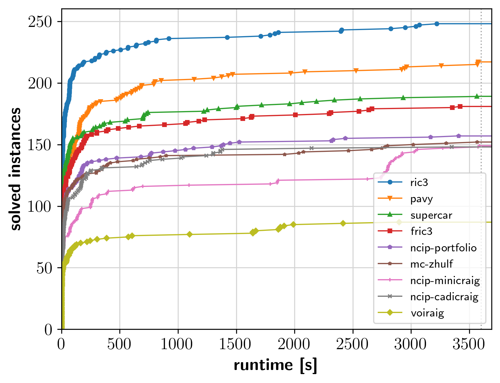
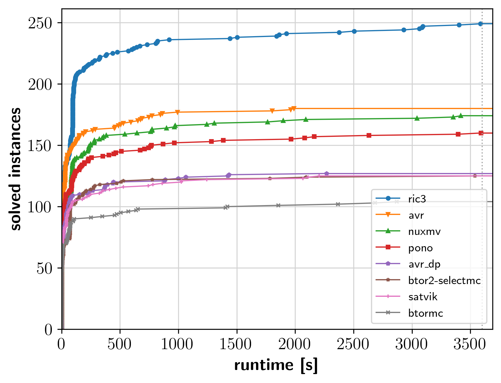

# HWMCC'24

This was the 12th competitive event for hardware model checkers.

## Affiliated to [FMCAD'24](https://fmcad.forsyte.at/FMCAD24/)
### October 14 - 18, 2024, Prague, Czech Republic

## Results

In total we awarded **9 "medals"**: gold/silver/bronze for 1st/2nd/3rd
place in each track.

|                        | **gold** | **silver** | **bronze** |
| ---------------------- | -------- | ---------- | ---------- |
| **ric3**               |        2 |            |            |
| **avr**                |        1 |          1 |            |
| **pavy**               |          |          1 |            |
| **pono**               |          |          1 |            |
| **nuxmv**              |          |            |         3  |
| **supercar**           |          |            |         1**  |
| **fric3**              |          |            |         1* |

\* Due to some execution issues on our cluster with fric3, it was originally
placed last in the bit-level track. After fixing the issue on our side and
rerunning the original submission with the fixed setup, the submission placed
3rd in the bit-level track. Hence, we additionally awarded a second bronze
medal in the bit-level track.

\*\* SuperCAR reported sat/unsat inconsistently for some of its engines, which
     only wrote certificates without printing any additional output.
     The execution environment however originally relied on these answers.
     After taking this into account and rerunning the original submission of
     SuperCAR, the submission placed again 3rd place in the bit-level track.

### Bit-Level Track

<a href="hwmcc24_cdf_aiger.png"></a>

#### Results (Solved)

```
                 total  solved  sat  unsat  unknown  time_real   time_cpu      memory  best  uniq  dis 
 ric3              319     248   72    176        0   291344.1  4153052.2   4493951.9    95    13    0 
 pavy              319     217   51    166        1   390161.4  3786142.4   7301625.4    28     3    0 
 supercar          319     189   66    123        0   436700.9  5223233.6   4945501.0    20     5    8 
 fric3             319     181   49    132       16   477563.0  4707881.2   4117612.8     5     1    0 
 ncip-portfolio    319     157   47    110       12   565994.4  1695151.4  14808792.5     0     0    0 
 mc-zhulf          319     152   51    101       81   450168.9  2190356.5   5056389.8    24     1    0 
 ncip-minicraig    319     149   43    106        0   702887.5   702827.6   3201387.1    44     1    0 
 ncip-cadicraig    319     148   47    101        0   626478.5   626813.5  12445563.0    32     0    0 
 voiraig           319      87   19     68        0   856670.4   856461.7    498891.1    17     0    0 
```

Note: The results are the solving statistics (uncertified).


#### Results (Certified)

```
                 total  solved  sat  unsat  unknown  time_real  time_cpu   memory  uniq 
 ric3              319     248   72    176       71    14544.3   10607.7  63367.5    20 
 pavy              319     217   51    166      102    37453.0   36613.6  74588.3     3 
 supercar          319     177   54    123      122     5722.5    5626.6  48791.2     5 
 fric3             319     174   46    128      138    11525.3    9600.2  74005.5     1 
 mc-zhulf          319     152   51    101      167      808.4     322.1   6348.5     1 
 ncip-portfolio    319     149   47    102      162     6265.2    3566.1  42353.9     0 
 ncip-cadicraig    319     148   47    101      171     4566.2    3232.5  39151.9     0 
 ncip-minicraig    319     140   43     97      170     5408.4    3291.8  45329.7     0 
 voiraig           319      87   19     68      232      762.4     353.5   5641.9     0 
```

Note: The results are the certification statistics. The time and memory columns
refer to the resources used by aigsim and certfaiger to validate the produced
certificates.

### Word-Level Track: Bit-Vectors

<a href="hwmcc24_cdf_btor2_bv.png"></a>

```
                 total  solved  sat  unsat  unknown  time_real  time_cpu    memory  best  uniq 
 ric3              319     249   72    177        0     297749   4198237  12412529    88    34 
 avr               319     180   53    127      128     485581   4983847  16061230     4     1 
 nuxmv             319     174   44    130       64     277837   1654862   5229664    17     2 
 pono              319     160   52    108        0     389448   4920452  16119475     4     2 
 avr_dp            319     127   26    101      384     527823   2235222   2993829    17     0 
 btor2-selectmc    319     125   21    104       70     462172    470502    804063    33     0 
 satvik            319     125   49     76      168     503167   9657805  11436575    22     0 
 btormc            319     104   48     56        0     787777    787654   3694299    74     0 
```

### Word-Level Track: Bit-Vectors+Arrays

<a href="hwmcc24_cdf_btor2_array.png"></a>


```
             total  solved  sat  unsat  unknown  time_real  time_cpu    memory  best  uniq 
 avr           321     200  102     98      117     435088   4767808   9604215    23     9 
 pono          321     149   87     62        0     609128   5303197   9843296     5     1 
 nuxmv         321     133   45     88      121     244252   1401939   1828014    83     3 
 btormc        321     121   96     25        0     717497    717164   1007327    93     0 
 btor2-cert    321      14   14      0      190     249048    442224  11768536     0     0 
```

## Slides

<a href="hwmcc24slides.pdf"></a>

The slides summarizing the results and presented in the
[HWMCC session](https://fmcad.org/FMCAD24/program/) at
[FMCAD](https://fmcad.forsyte.at/FMCAD24)
are available as [hwmcc24slides.pdf](hwmcc24slides.pdf).


## Competition Benchmarks

The benchmarks used in each track can be found on
[Zenodo](https://zenodo.org/records/14156844).

### Benchmark Contributors

Many thanks to this year's benchmark submitters:

- Jannis Harder (YosysHQ)
- Zhiyuan Yan, Guangyu Hu, Ziyue Zheng, You Li,
  Guannan Zhao, Yangdi Lyu, Hongce Zhang, Xiaofeng Zhou (Hong Kong University
  of Science and Technology, Northwestern University)
- Po-Chun Chien, Nian-Ze Lee (LMU Munich)

## CSV Files

- [Bit-level: Solved](hwmcc24_aiger.csv)
- [Bit-level: Certified](hwmcc24_aiger_cert.csv)
- [Word-level: Bit-Vectors](hwmcc24_btor2_bv.csv)
- [Word-level: Bit-Vectors+Arrays](hwmcc24_btor2_array.csv)


## Format

This year we had **three tracks** with **single safety** properties:

1. Word-level without arrays
2. Word-level with arrays
3. Bit-level with mandatory safety certificates

Note that for 3) we translated the word-level benchmarks from 1) to
[AIGER](https://github.com/arminbiere/aiger) bit-level benchmarks.
The certificate was checked with [Certifaiger](https://github.com/Froleyks/certifaiger)
and counter examples with [aigsim](https://github.com/arminbiere/aiger).

As in previous years, the word-level track was based on the BTOR2 format, which
is described in
[BTOR2 CAV'18 paper](https://link.springer.com/content/pdf/10.1007%2F978-3-319-96145-3_32.pdf).
The [Btor2Tools](https://github.com/Boolector/btor2tools/)
tool suite provides a generic parser
[Btor2Parser](https://github.com/Boolector/btor2tools/tree/master/src/btor2parser)
and a simulator
[BtorSim](https://github.com/Boolector/btor2tools/tree/master/src/btorsim),
which are useful for parsing and random simulation of BTOR2 models, as well as
for witness checking.
There is also a simple bounded model checker
[BtorMC](https://github.com/Boolector/boolector/blob/master/src/btormc.c),
distributed as part of
[Boolector](https://github.com/Boolector/boolector).


## Setup

The hardware setup for the competition was as follows: the cluster machines we
used were equipped with
**AMD Ryzen 9 7950X 16-core** processors and **128 GB RAM**,
running **Ubuntu 20.04 LTS**.

Each model checker had full access to a node, i.e., 16 (physical) cores
and 128 GB of RAM.
A **memory limit of 120 GB**  was enforced with a **time limit of 1 hour**
of wall-clock time.


## Benchmarks

Submission deadline for new benchmarks was **August 18, 2024**. Please submit
your benchmarks in BTOR2 format. If benchmarks have multiple safety properties,
we will split them up in separate benchmarks with one safety property each.

## Submission

Please send model checker and benchmarks submissions to  
- [Armin Biere](mailto:biere@cs.uni-freiburg.de)
- [Nils Froleyks](mailto:nils.froleyks@jku.at)
- [Mathias Preiner](mailto:preiner@cs.stanford.edu)

**Registration and first versions** of model checkers were due on
**September 1, 2024**.

All submission dates are anywhere on earth (AoE). Make sure that the submission
can be **executed under Ubuntu 20.04 LTS**. The safest bet is to provide
**statically linked binaries**.

### Bit-Level Certificate Output

Certificates should be written to an output file in the **current working
directory**, ideally to a file called `certificate.aig` (for binary AIGER) and
`certificate.aag` (for ASCII AIGER). If the name of the certificate is
different, please mention this in your submission.


## Organization

HWMCC'24 was organized by

- [Armin Biere](https://cca.informatik.uni-freiburg.de/biere),
  [University of Freiburg](https://uni-freiburg.de), Germany
- [Nils Froleyks](http://fmv.jku.at/froleyks), 
  [Johannes Kepler University Linz](http://www.jku.at), Austria
- [Mathias Preiner](https://cs.stanford.edu/~preiner),
  [Stanford University](https://www.stanford.edu), USA
