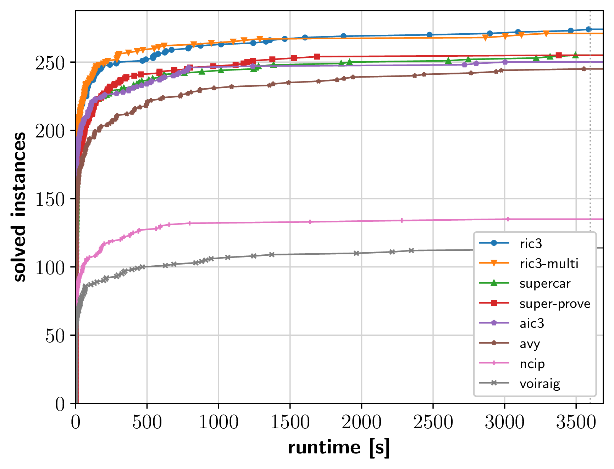
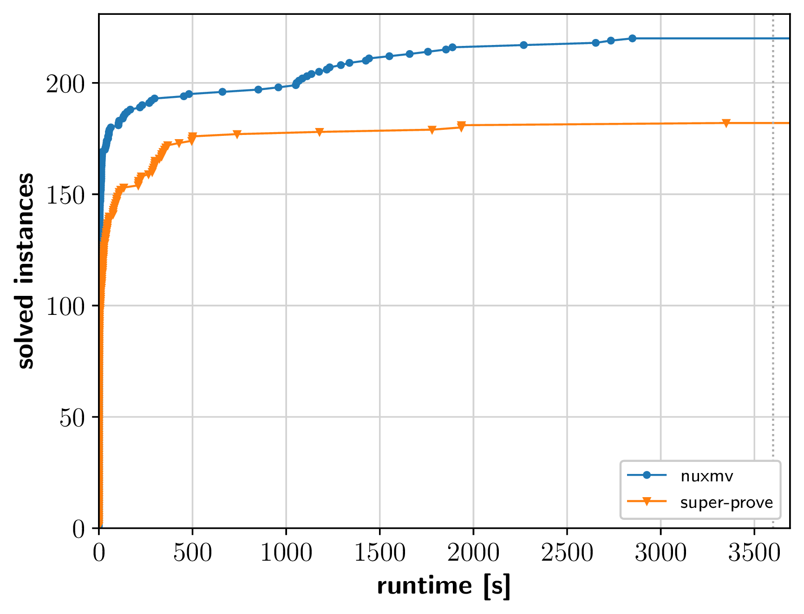
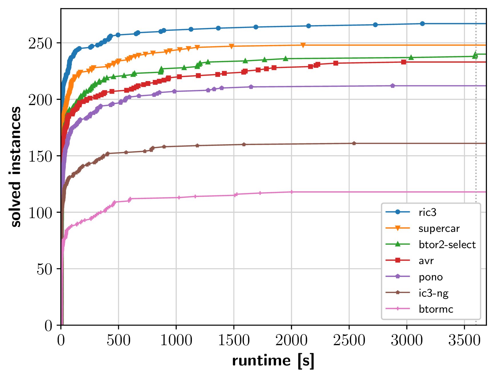
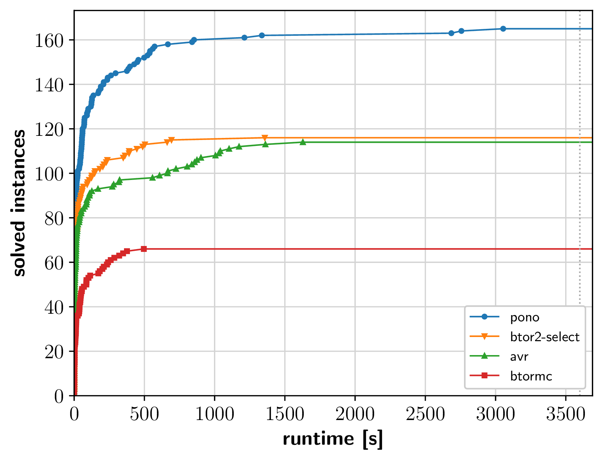
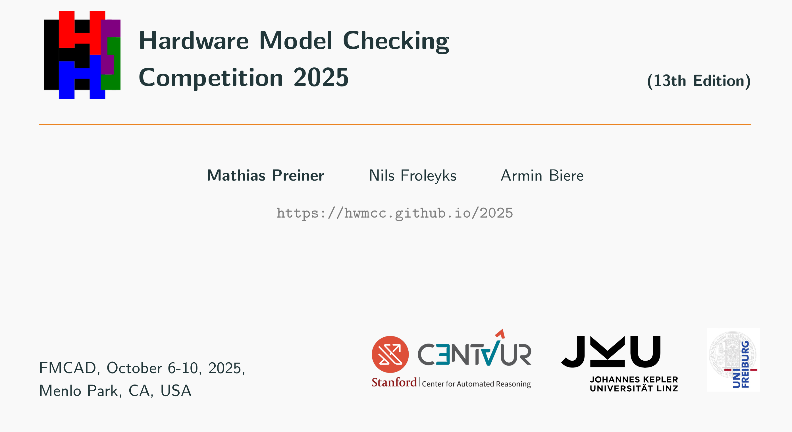

# HWMCC'25

This is the 13th competitive event for hardware model checkers.

## Affiliated to [FMCAD'25](https://fmcad.forsyte.at/FMCAD25/)
### October 6 - 10, 2025, Menlo Park, California, USA

## Zenodo Artifact

**Benchmarks**, **certificates** and **log files** are available on
[Zenodo](https://zenodo.org/records/17428464).

## Results

In total we awarded **10 "medals"**: gold/silver/bronze for 1st/2nd/3rd
place in each track.

|                        | **gold** | **silver** | **bronze** |
| ---------------------- | -------- | ---------- | ---------- |
| **ric3**               |        2 |            |            |
| **nuxmv**              |        1 |            |            |
| **pono**               |        1 |            |            |
| **supercar**           |          |          1 |          1 |
| **ric3-multi**         |          |          1 |            |
| **avr**                |          |          1 |            |
| **btor2-select**       |          |            |          2 |


### Bit-Level Safety Track

<a href="bitlevel_safety.png"></a>

##### Results (Uncertified)

Note: The results are the solving statistics (uncertified).
```
             solved  sat  unsat    real      cpu       mem  best   uniq
ric3            274   99    175  207908  3272359   4146711    44      3
ric3-multi      271  101    170  238854  3254708   3286020    50      2
super-prove     255   88    167  283251  3375253   1920039    35      2
supercar        255   97    158  307317  4100273   3074068     4      1
aic3            250   81    169  308768  3826429   2433956   130      1
avy             245   83    162  352625  2454704   2202759     4      0
ncip            135   58     77  327572  3920514  24762956     5      1
voiraig         114   33     81  804417   804622    362791    12      0
```

##### Results (Certified)

```
                 certified  sat        unsat      uniq  timeout
1   ric3               274   99         175          4        0
2   ric3-multi         266  101         165 (-4)     2        1
3   supercar           255   97         158          1        0
    aic3               248   81         167 (-2)     0        0
    avy                226   68 (-15)   158 (-3)     0        1
    ncip               135   58          77          1        0
    voiraig            114   33          81          0        0
    super-prove         80   80 (-8)    167 (-167)   0        0
```

### Bit-Level Liveness Track

<a href="bitlevel_live.png"></a>

##### Results (Uncertified)

Note: The results are the solving statistics (uncertified).
```
             solved  sat  unsat    real      cpu      mem  best  uniq
nuxmv           220  107    113  199944  2360722  2345505   174    42
super-prove     182  86      96  209945   631775  4967024    50     4
```

##### Results (Certified)

```
                certified  sat        unsat  uniq
1  nuxmv              220  107          113   127
   super-prove         96    0 (-86)     96     3

```

### Word-Level Bit-Vector Track

<a href="wordlevel_bv.png"></a>

##### Results (Uncertified)

Note: The results are the solving statistics (uncertified).
```
              solved  sat  unsat    real      cpu       mem  best  uniq
ric3             267   97    170  196539  3001965   4799963   158    15
supercar         248   97    151  316318  4222838   3102287     8     1
btor2-select     240   86    154  350761  1687279   2518731    14     1
avr              233   83    150  380987  5440794   8551739    57     6
pono             212   80    132  346052  5503963  13212915     6     0
ic3-ng           161   47    114  621360  1643612   3220367    24     0
btormc           118   70     48  781675   781898   1474747    26     0
```

##### Results (Certified)

```
                 certified  sat        unsat   uniq
1  ric3                267   97          170     15
2  supercar            248   97          151      1
3  btor2-select        240   86          154      1
   avr                 229   79  (-4)    150      6
   pono                212   80          132      0
   ic3-ng              161   47          114      0
   btormc              118   70           48      0
```

### Word-Level Arrays Track

<a href="wordlevel_array.png"></a>

##### Results (Uncertified)

Note: The results are the solving statistics (uncertified).
```
              solved   sat   unsat    real      cpu       mem  best  uniq
pono             165    55     110  507922  5829196  11337189    92    45
btor2-select     116    58      58  460647  1579191  12021545    28     3
avr              114    45      69  367836  4322341  19333338    33     7
btormc            66    53      13  838396   838600   1622844    25     0
```

##### Results (Certified)


```
                 certified  sat       unsat  uniq  timeout
1  pono                165   55         110    45        0
2  avr                 114   45          69     7        0
3  btor2-select        112   54 (-3)     58     2        1
   btormc               66   53          13     0        0
```


## Slides

<a href="hwmcc25slides.pdf"></a>

The slides summarizing the results and presented in the
[HWMCC session](https://fmcad.org/FMCAD25/program/) at
[FMCAD](https://fmcad.forsyte.at/FMCAD25)
are available as [hwmcc25slides.pdf](hwmcc25slides.pdf).

## Format

This year we will have the following **four tracks**:

1. Word-level safety without arrays
2. Word-level safety with arrays
3. Bit-level safety
4. Bit-level liveness **(new)**

Note that for track 3 we translate the word-level benchmarks from word-level
track 1 to [AIGER](https://github.com/arminbiere/aiger) bit-level benchmarks.
Note that bit-level tracks will be in **AIGER 1.9** (including [reset functions](#reset-functions)).

### Certificates

In the word-level tracks (1 and 2) producing **BTOR2 counterexamples
will be mandatory**.
The BTOR2 counterexamples will be checked with [BtorSim](https://github.com/Boolector/btor2tools/tree/master/src/btorsim).
As in HWMCC'24, for the **bit-level track, both counterexamples and safety certificates are mandatory**.
The certificates will be checked with [Certifaiger](https://github.com/Froleyks/certifaiger)
and counterexamples with [aigsim](https://github.com/arminbiere/aiger).

As in previous years, the word-level track uses the BTOR2 format described in
[BTOR2 CAV'18 paper](https://link.springer.com/content/pdf/10.1007%2F978-3-319-96145-3_32.pdf).
The [Btor2Tools](https://github.com/hwmcc/btor2tools/)
tool suite provides a generic parser
[Btor2Parser](https://github.com/hwmcc/btor2tools/tree/master/src/btor2parser)
and a simulator
[BtorSim](https://github.com/hwmcc/btor2tools/tree/master/src/btorsim),
which are useful for parsing and random simulation of BTOR2 models, as well as
for witness checking.
There is also a simple bounded model checker
[BtorMC](https://github.com/Boolector/boolector/blob/master/src/btormc.c),
distributed as part of
[Boolector](https://github.com/Boolector/boolector).

### Reset Functions
While the AIGER 1.9 format allows latches to be reset to 0, 1, or remain uninitialized,
reset functions additionally allow latches to be reset to an arbitrary gate.

## Setup

The hardware setup for the competition is as follows: the cluster machines we
use are equipped with
**AMD Ryzen 9 7950X 16-core** processors and **128 GB RAM**,
running **Ubuntu 24.04 LTS**.

Each model checker will have full access to a node, i.e., 16 physical (32
virtual) cores and 128 GB of RAM.
A **memory limit of 120 GB** is enforced with a **time limit of 1 hour**
of wall-clock time.


## Benchmark Submission

Submission deadline for new benchmarks is **August 17, 2025 AoE**.
Please submit safety benchmarks in BTOR2 format and bit-level liveness
benchmarks in AIGER 1.9. Word-level liveness benchmarks are welcome but will not
be used in this year's competition.
If benchmarks have multiple safety/liveness properties, we will split them up
in separate benchmarks with one property each.

Please submit benchmarks to
- [Armin Biere](mailto:biere@cs.uni-freiburg.de)
- [Nils Froleyks](mailto:nils.froleyks@jku.at)
- [Mathias Preiner](mailto:preiner@cs.stanford.edu)

## Model Checker Submission

**Registration and first versions** of model checkers are due on
**September 1, 2025**.

All submission dates are anywhere on earth (AoE). We require the submission to
use **statically compiled binaries** to ensure proper execution in the provided
cluster environment. Make sure that the tool can be **called from any
directory**. Only **one version per model checker** allowed.

**Submission Test Setup**: To make sure that your submission is running in the
competition environment, we provide the following [Ubuntu 24.04 Docker
image](hwmcc25-test-setup.tar.gz). Follow the provided README.md to make sure
that your submission can be executed successfully without errors within this
image before submitting.

**Submission**: Please send model checker and benchmarks submissions to
- [Armin Biere](mailto:biere@cs.uni-freiburg.de)
- [Nils Froleyks](mailto:nils.froleyks@jku.at)
- [Mathias Preiner](mailto:preiner@cs.stanford.edu)

### Mandatory Command Line Interface

The **mandatory interface** for each submission is as follows.

**Bit-level track**
```
<tool> <benchmark> <certificate.sat> <certificate.unsat>
```
where
- `<benchmark>` is the AIGER 1.9 benchmark
- `<certificate.sat>` the path of the AIGER counterexample
- `<certificate.unsat>` the path of the safety certificate

The format (binary / ascii) of the certificate.unsat should depend on the file extension of the argument (.aig for binary, .aag for ascii). During the competition we will always expect binary certificates.

**Word-level track**
```
<tool> <benchmark> <certificate.sat>
```

where
- `<benchmark>` is the BTOR2 benchmark
- `<certificate.sat>` the path of the BTOR2 counterexample


**Temporary files** must be written to `/tmp` and should be cleaned up by the model checker before exiting.

**Output** Model checkers are required to print `sat`/`unsat` (in one line) to `stdout` in case of unsafe/safe properties.


## Organization

HWMCC'25 is organized by

- [Armin Biere](https://cca.informatik.uni-freiburg.de/biere),
  [University of Freiburg](https://uni-freiburg.de), Germany
- [Nils Froleyks](http://fmv.jku.at/froleyks), 
  [Johannes Kepler University Linz](http://www.jku.at), Austria
- [Mathias Preiner](https://cs.stanford.edu/~preiner),
  [Stanford University](https://www.stanford.edu), USA
